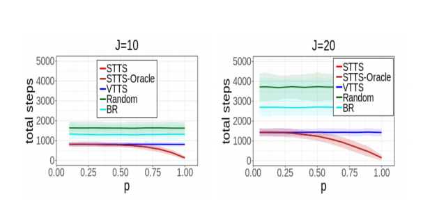
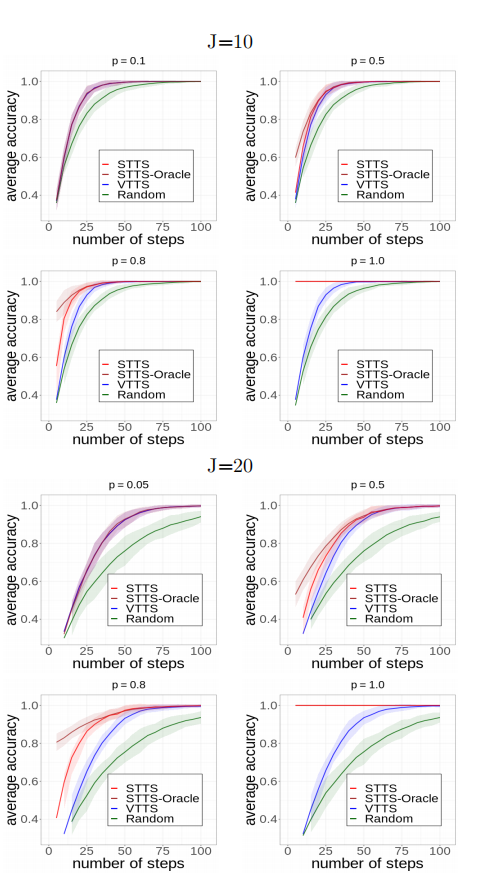
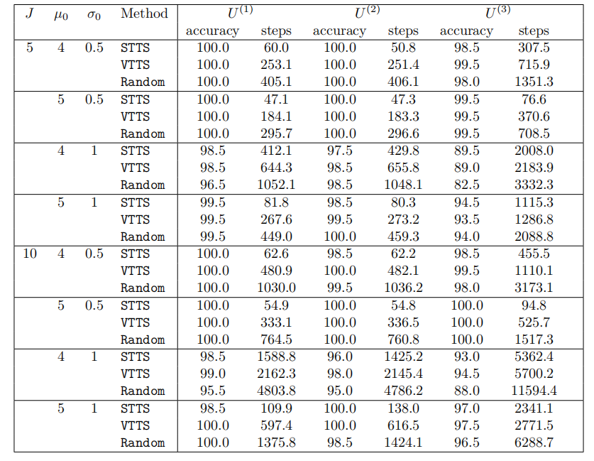

# P300SequentialBAI
This repository is the implementation of "Sequential Best-Arm Identification with Application to P300 Speller" in python.

## Summary of the paper

A brain-computer interface (BCI) is an advanced technology that facilitates direct communication between the human brain and a computer system, by enabling individuals to interact with devices using only their thoughts. The P300 speller is a primary type of BCI system, which allows users to spell words without using a physical keyboard, but instead by capturing and interpreting brain electroencephalogram (EEG) signals under different stimulus presentation paradigms. Traditional non-adaptive presentation paradigms, however, treat each word selection as an isolated event, resulting in a lengthy learning process. To enhance efficiency, we cast the problem as a sequence of best-arm identification tasks within the context of multi-armed bandits, where each task corresponds to the interaction between the user and the system for a single character or word. Leveraging large language models, we utilize the prior knowledge learned from previous tasks to inform and facilitate subsequent tasks. We propose a sequential top-two Thompson sampling algorithm under two scenarios: the fixed-confidence setting and the fixed-budget setting. We study the theoretical property of the proposed algorithm, and demonstrate its substantial empirical improvement through both simulations as well as the data generated from a P300 speller simulator that was built upon the real BCI experiments.

## Requirement
+ Python 3.7
    + numpy 1.21.6
 
## File Overview
- `py/`: This module contains all python functions used in synthetic experiments. For the P300 simulator, please contact the authors at [here](https://ieeexplore.ieee.org/document/9669724).
  - `agent.py` contains the agent functions to implement STTS, VTTS, and Random policy.
  - `LanguageModel.py` contains the utility functions to implement the language model.
  - `Bandit_env.py` contains the utility functions for bandit environments.
  - `run_FixedConfidence.py` runs the synthetic expeirments for fixed-confidence setting in Section 5.2.
  - `run_FixedBudget.py` runs the synthetic expeirments for fixed-budget setting in Section 5.3.
  - `run_run_AlternativePrior.py` runs the synthetic expeirments with Gaussian priors in Section B of the appendix.
- `Figure/`: This folder provides the synthetic experiment results.

**Figures**:  

Fixed-confidence setting (Section 5.2)

 
 
Fixed-budget setting (Section 5.3)

 
 
Alternative prior specification (Section B iof the appendix)

 

 
